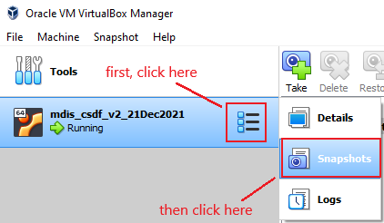

<title>CSDF mDIS VM Manual</title>

## CSDF mDIS VirtualBox VM User's Guide

January 14, 2022

* * *

### Table of Contents

[Introduction](#intro)  
[Starting Oracle VirtualBox](#starting_vb)  
[Starting the mDIS VM in VirtualBox](#starting)  
[Running the mDIS application](#running)  
[Stopping the mDIS VM in VirtualBox](#stopping)  
[Connecting to mDIS](#connecting)  
[Creating and Restoring Backups](#backups)  
[Troubleshooting](#troubleshooting)  
  

### Introduction

The mobile Drilling Information System (mDIS) application runs in a virtual machine (VM) on the Oracle VirtualBox application.  

To access the mDIS, both the Oracle VirtualBox application and the mDIS VM must be running, which looks like this.   

Additionally, the mDIS application must be running within the mDIS VM. To check this, view the VM's window by clicking the green "Show" arrow in VirtualBox, or by clicking the VM's Taskbar icon, which looks like this:   

If the mDIS application is running correctly, you should see this:  
  

If you see both of the above, you should be able to [connect to mDIS](#connecting).

If not, follow the appropriate steps below.
  

### Starting Oracle VirtualBox

Oracle VirtualBox is a Windows application. You should see its icon on the Taskbar:  Click the icon to launch VirtualBox.  

If the VirtualBox icon isn't in the Taskbar, navigate to Oracle VM VirtualBox in the Start Menu and use the icon to launch:  

  

### Starting the mDIS VM in VirtualBox

In VirtualBox, the mDIS VM state should be Running, which looks like this.  
  

If the VM state is anything other than Running (Saved, Powered Off, Paused, etc), run the VM by clicking the green Start arrow.  
  

Eventually the VM state will change to "Running", and the label of the green Start arrow will change to "Show".  
  

### Running the mDIS application

Once the mDIS VM is running in VirtualBox, you can click the green Show arrow to view the VM window.  

If it looks like this, the mDIS application is running properly. You should be able to [connect to mDIS](#connecting).  
  

If it looks like this, the mDIS application needs to be run.  
  

First, login with the following credentials:  

`Login: vagrant` 
`Password: vagrant` 

You should now see something like this:  
  

Enter the following commands **exactly**, hitting enter after each:  

`cd proj/mdis` 
`sudo docker-compose up -d` 
  
Now you should see something like this:  
  

Enter one last command:  

`npm run serve`  

Now you'll see progress messages like this for a minute or two:  
  

After the build is complete, you should see the image at the top of this section. You can now [connect to mDIS](#connecting).  
  

### Stopping the mDIS VM in VirtualBox

Unless you need to Restore an existing Snapshot, there should be no need to manually stop the mDIS VM. If you turn off your computer while the VM is running in VirtualBox, its state will be Saved automatically.

To stop the mDIS VM, right-click the VM in VirtualBox, navigate to "Close" in the menu, and select one of the three options:

If you choose "Save State", the mDIS application should resume running when the VM is started back up.

If you choose "ACPI Shutdown" or "Power Off", you'll need to [run the mDIS application](#running) when the VM is started back up.
  

### Connecting to mDIS

In your browser, enter `localhost:3030` into the address bar and hit Enter. You should see the mDIS login page.  

  

Use the following credentials to login:  

`Login: dev1  
Password: dev1pw  
`
  

### Creating and Restoring Backups

Backups of the mDIS VM data are created using Snapshots in VirtualBox. A Snapshot saves the current state of the Virtual Machine to a file. This file can then be copied to an external drive for backup.
  

#### Creating Snapshots in VirtualBox

To access Snapshots in VirtualBox, click the menu icon in the VM item and choose "Snapshots":  
  

You should now see the following:

  

Initially you'll only see the "Current State" item in the list on the right. Snapshots will be added to this list as they're created.

To create a snapshot:

1.  Select the "Current State" item.
2.  Click the "Take" button.
3.  Enter a name and description of the snapshot, then click OK.

Now, you should see your new snapshot in the list:

  

Take another snapshot, and the list will grow:

  

After taking a third snapshot:

  

Notice that the most recent snapshot is the one immediately above "Current State".
  

#### Restoring a Snapshot in VirtualBox

Now suppose something went horribly wrong in mDIS. To get things working again, we'll need to restore our most-recent snapshot, titled "A Third Snapshot 1/14/2022 3:48pm". To restore a snapshot:

1.  [Stop the VM](#stopping) with any of the three options (Save State, ACPI Shutdown, Power Off).
2.  Select the Snapshot you want to restore.
3.  Click the "Restore" button.
4.  When prompted, uncheck the "Create a snapshot of the current machine state" box.
5.  Then, click Restore.
6.  Select "Current State" and click the green "Start" arrow.
7.  If necessary, [restart the mDIS application.](#running)
8.  Continue using mDIS as usual.

**Important:** Data that was added to mDIS after the most-recent Snapshot was taken will be lost! It will need to be re-entered and saved.
  

#### Backing up Snapshot files to an external drive

Each snapshot creates a corresponding file with the extension ".sav". These files are placed in a folder called "mDIS Snapshots Folder" on the Desktop. Open that folder and find the .sav file with the most recent date. This is the Snapshot you just created. Copy that file to an external drive to backup.
  

### Troubleshooting

**After I click the mDIS VM window, I can't see my mouse cursor!**  

When clicked, the VM window will "capture" the mouse until it is released. To do so, press the Control key **on the right** (not left) side of the keyboard. You should then be able to use the mouse as usual.  

**In VirtualBox, the VM state isn't "Running", but the green Start/Show arrow is disabled!**  

This can happen if the VM is waiting for the user to respond to a warning or error message. Look in the Taskbar for the VM window's icon , click it to view the VM, then respond to the message. This should enable the green Start/Show arrow.  

**I see warnings when starting up the mDIS VM!**  

These warnings can safely be ignored.